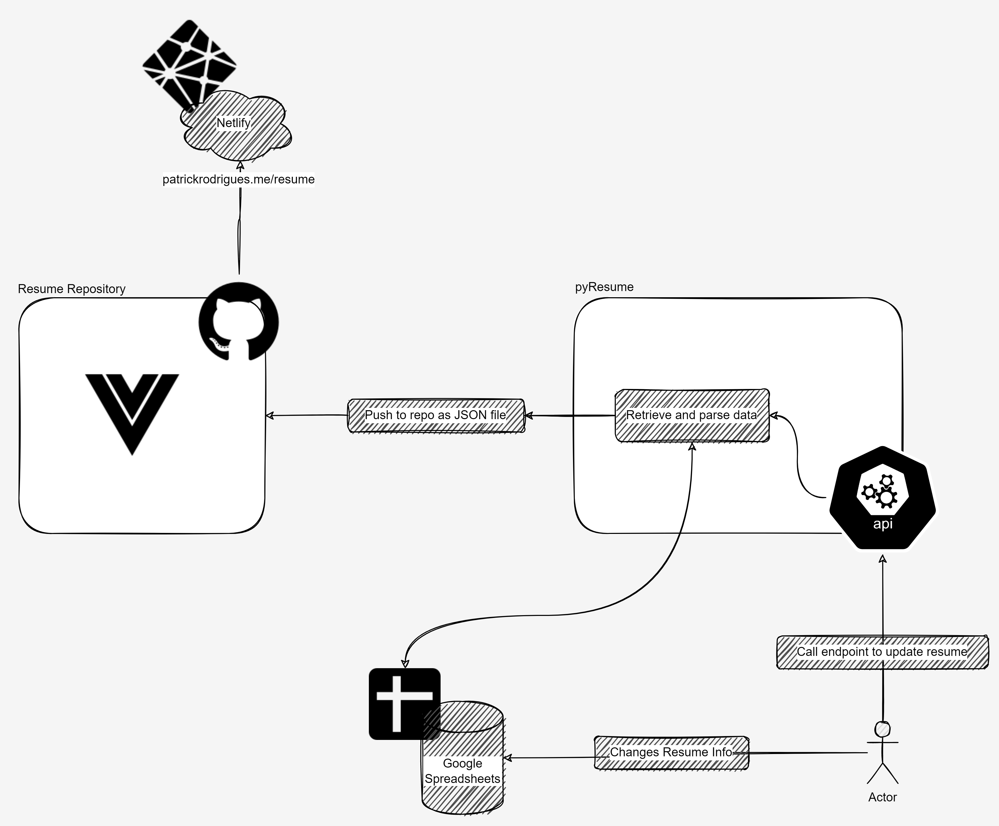

# PyResume
API to get the most recent version of your Resume stored in Google Spreadsheets and send to a GitHub repository. 



## Prerequisites

To run this project, you need the following prerequisites:
- Python 3.10 or greater
- The Poetry package and virtual environment management tool
- A Google Cloud Platform project with API enabled. To create a project and enable an API, refer to [Create a project and enable the API](https://developers.google.com/workspace/guides/create-project)
  - Note: For this project, you are enabling the "Google Sheets API".
- Authorization credentials for a desktop application. To learn how to create credentials for a desktop application, refer to [Create credentials](https://developers.google.com/workspace/guides/create-credentials).
- A Google account.
- A GitHub repository that you can push changes
- A GitHub personal token
  - Note: For this project, you are enabling "repo" permissions


## Step 1: Create virtual environment
```shell
poetry env use 3.10.2
```

## Step 2: Install the project dependencies
To install the Python libraries used for this project:
- From command-line, execute the following command:
```shell
poetry install
```

## Step 3: Activate the project virtual environment
To activate the virtual environment:
- From command-line, execute the following command:
```shell
poetry shell
```

## Step 4: Run the project
To run the project:
- From the command-line, execute the following command:
```shell
python main.py
```

## Step 5: Call Resumes endpoint
- [http://localhost:8000/v1/resumes](http://localhost:8000/v1/resumes)


### (Optional) Step 6: Check the docs
- [http://localhost:8000/docs](http://localhost:8000/docs)
